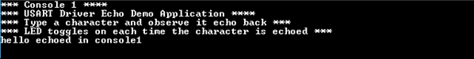

# USART driver synchronous - USART multi instance

This example echoes the received characters over the two consoles using the USART driver in synchronous mode.

## Description

This example uses the USART driver in synchronous mode in both Bare-Metal and RTOS environments to communicate over two consoles. It receives and echoes back the characters entered by the user on the respective console.

## Downloading and building the application

To clone or download this application from Github, go to the [main page of this repository](https://github.com/Microchip-MPLAB-Harmony/core_apps_sam_e70_s70_v70_v71) and then click Clone button to clone this repository or download as zip file.
This content can also be downloaded using content manager by following these [instructions](https://github.com/Microchip-MPLAB-Harmony/contentmanager/wiki).

Path of the application within the repository is **apps/driver/usart/sync/usart_multi_instance/firmware** .

To build the application, refer to the following table and open the project using its IDE.

| Project Name      | Description                                    |
| ----------------- | ---------------------------------------------- |
| sam_e70_xult_freertos.X | MPLABX project for [SAM E70 Xplained Ultra Evaluation Kit](https://www.microchip.com/DevelopmentTools/ProductDetails/PartNO/DM320113) |
| sam_v71_xult_freertos.X | MPLABX project for [SAM V71 Xplained Ultra Evaluation Kit](https://www.microchip.com/developmenttools/ProductDetails/atsamv71-xult) |
|||

## Setting up the hardware

The following table shows the target hardware for the application projects.

| Project Name| Board|
|:---------|:---------:|
| sam_v71_xult_freertos.X | [SAM V71 Xplained Ultra Evaluation Kit](https://www.microchip.com/developmenttools/ProductDetails/atsamv71-xult) |
| sam_e70_xult_freertos.X | [SAM E70 Xplained Ultra Evaluation Kit](https://www.microchip.com/DevelopmentTools/ProductDetails/PartNO/DM320113) |
|||

### Setting up [SAM E70 Xplained Ultra Evaluation Kit](https://www.microchip.com/DevelopmentTools/ProductDetails/PartNO/DM320113)

- To run the application, following additional hardware are required
  - [mikroBUS Xplained Pro board](https://www.microchip.com/developmenttools/ProductDetails/ATMBUSADAPTER-XPRO)
  - [USB UART click board](https://www.mikroe.com/usb-uart-click)

- Connect a [USB UART click board](https://www.mikroe.com/usb-uart-click) on to to the MikroBus header
- Connect the Debug USB port on the board to the computer using a micro USB cable (This will enumerate as a COM port)
- Connect mini USB cable to the [USB UART click board](https://www.mikroe.com/usb-uart-click) (This will enumerate the second port)

### Setting up [SAM V71 Xplained Ultra Evaluation Kit](https://www.microchip.com/developmenttools/ProductDetails/atsamv71-xult)

- To run the application, following additional hardware are required
  - [mikroBUS Xplained Pro board](https://www.microchip.com/developmenttools/ProductDetails/ATMBUSADAPTER-XPRO)
  - [USB UART click board](https://www.mikroe.com/usb-uart-click)

- Connect the [mikroBUS Xplained Pro board](https://www.microchip.com/developmenttools/ProductDetails/ATMBUSADAPTER-XPRO) to the EXT1 header
- Install an [USB UART click board](https://www.mikroe.com/usb-uart-click) on to the [mikroBUS Xplained Pro board](https://www.microchip.com/developmenttools/ProductDetails/ATMBUSADAPTER-XPRO)
- Connect the Debug USB port on the board to the computer using a micro USB cable (This will enumerate as a COM port)
- Connect mini USB cable to the [USB UART click board](https://www.mikroe.com/usb-uart-click) (This will enumerate the second port)

## Running the Application

1. Open the Terminal application (Ex.:Tera term) on the computer.
2. Connect to the EDBG/Jlink Virtual COM port and configure the serial settings as follows:
    - Baud : 115200
    - Data : 8 Bits
    - Parity : None
    - Stop : 1 Bit
    - Flow Control : None
3. Build and program the application using its IDE
4. Type a character and observe the output on the two consoles as shown below:
    - If success the 10 characters typed are echoed back and an LED toggles on each time 10 characters are echoed
    - **Console 1**

    

    - **Console 2**

    

Refer to the following table for LED name:

| Board | LED Name |
| ----- | -------- |
|  [SAM E70 Xplained Ultra Evaluation Kit](https://www.microchip.com/DevelopmentTools/ProductDetails/PartNO/DM320113) | LED1 |
|  [SAM V71 Xplained Ultra Evaluation Kit](https://www.microchip.com/developmenttools/ProductDetails/atsamv71-xult) | LED0 |
|||
