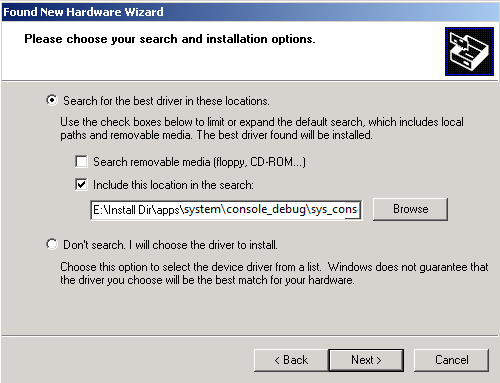
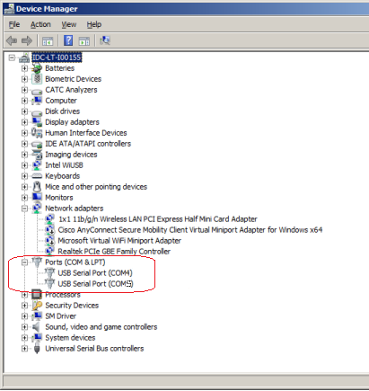
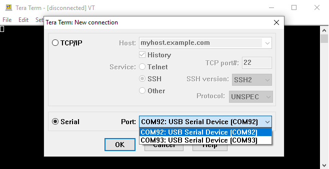
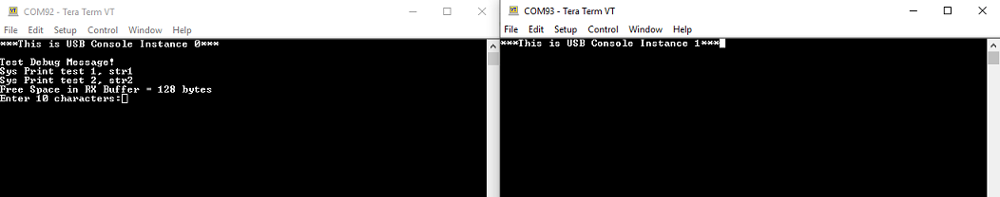
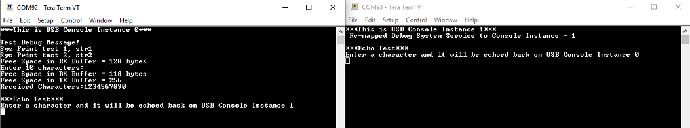
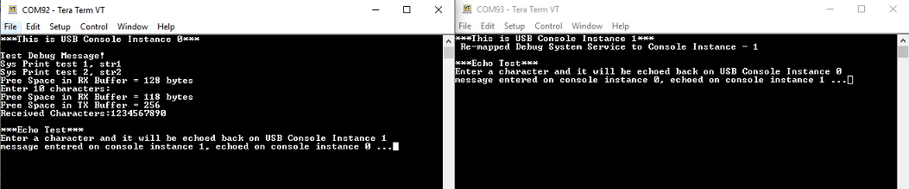

# Console Debug System Service using USB

This example application demonstrates the USB based console and debug system service.

## Description

- The application example demonstrates console and debug system service using two instances of console, each connected to an instance of the USB CDC function driver
- These will appear as two COM ports on the host PC
- The example first demonstrates the various debug system service APIs/macros.
- It then demonstrates the console related APIs.
- The application asks the user to enter a character on one console which is echoed back on the second console (and vice-versa), using the console system service read/write APIs.

## Downloading and building the application

To clone or download this application from Github, go to the [main page of this repository](https://github.com/Microchip-MPLAB-Harmony/core_apps_sam_e70_s70_v70_v71) and then click Clone button to clone this repository or download as zip file.
This content can also be downloaded using content manager by following these [instructions](https://github.com/Microchip-MPLAB-Harmony/contentmanager/wiki).

Path of the application within the repository is **apps/system/console_debug/sys_console_debug_usb_read_write/firmware** .

To build the application, refer to the following table and open the project using its IDE.

| Project Name      | Description                                    |
| ----------------- | ---------------------------------------------- |
| sam_e70_xult.X | MPLABX project for [SAM E70 Xplained Ultra Evaluation Kit](https://www.microchip.com/DevelopmentTools/ProductDetails/PartNO/DM320113) |
| sam_e70_xult_freertos.X | MPLABX project for [SAM E70 Xplained Ultra Evaluation Kit](https://www.microchip.com/DevelopmentTools/ProductDetails/PartNO/DM320113) |
|||

## Setting up the hardware

The following table shows the target hardware for the application projects.

| Project Name| Board|
|:---------|:---------:|
| sam_e70_xult.X   sam_e70_xult_freertos.X | [SAM E70 Xplained Ultra Evaluation Kit](https://www.microchip.com/DevelopmentTools/ProductDetails/PartNO/DM320113) |
|||

### Setting up [SAM E70 Xplained Ultra Evaluation Kit](https://www.microchip.com/DevelopmentTools/ProductDetails/PartNO/DM320113)

- Connect the Debug USB port on the board to the computer using a micro USB cable
- Jumper J203 must be shorted between PB08 and VBUS (positions 2 and 3)
- Use TARGET USB J202 connector on the board to connect the USB Device to the the USB Host PC

## Running the Application

1. Build and program the application using its IDE
2. Attach the device to the host. If the host is a personal computer and this is the first time you have plugged this device into the computer, you may be prompted for a .inf file.

    

3. Select the "Install from a list or specific location (Advanced)" option. Specify the \<install-dir\>/core_apps_pic32mz_ef/apps/system/console_debug/sys_console_debug_usb_read_write/inf directory.

    

    **Note:**
    - As an option, to specify the driver, you may open the device manager and expand the Ports (COM & LPT) tab, and right click on "Update Driver Software..."

        

    - Verify that the enumerated USB device is seen as a virtual USB serial comport in Device Manager.

        

4. Once the device is successfully installed, open up two instances of a terminal program, such as Tera Term. Select the appropriate COM port for each of these terminal instances. The following screen shot shows the COM port selection for the Tera Term terminal program.

    

5. Once the USB is enumerated
    - The LED on the demonstration board will be turned on.
    - Press the swtich on the development board and observe the following output on the terminals
    - The output on the console instance 0 prints the messages using the debug system service
    - It then prints the size of the receive buffer and asks the user to enter 10 characters on the terminal

    

6. Once, 10 characters are entered on console instance 0
    - The demonstration prints the free space available in the receive and transmit buffers
    - Since the receive buffer contains 10 unread characters, its free space will be reduced by 10
    - The received characters are read and echoed on the terminal
    - After this, the demonstration enters in echo test mode, where a character entered on console instance 0 will be echoed on console instance 1 and vice-versa

    

7. Enter a character on console instance 0 terminal and observe it getting echoed on console instance 1 terminal and vice-versa

    

Refer to the following table for LED name:

| Board | LED Name | Switch Name |
| ----- | -------- | ----------- |
|  [SAM E70 Xplained Ultra Evaluation Kit](https://www.microchip.com/DevelopmentTools/ProductDetails/PartNO/DM320113) | LED1 | SW0 |
||||
